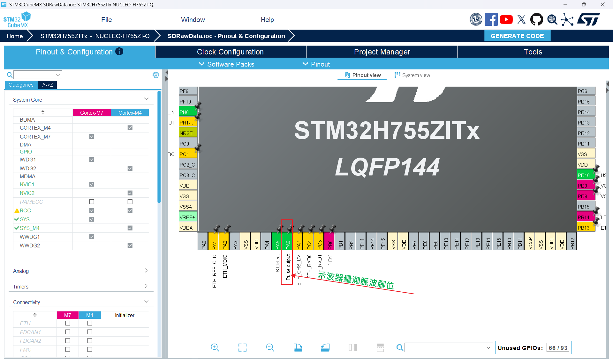
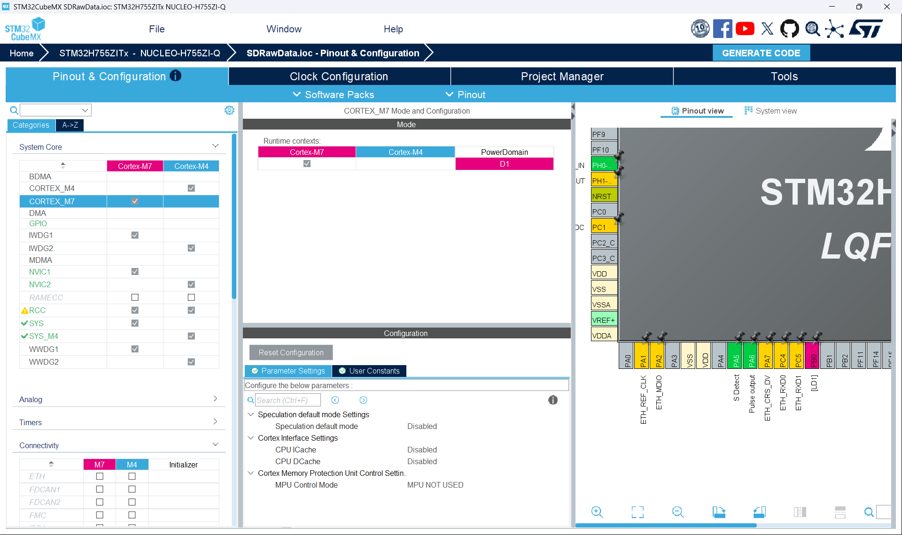
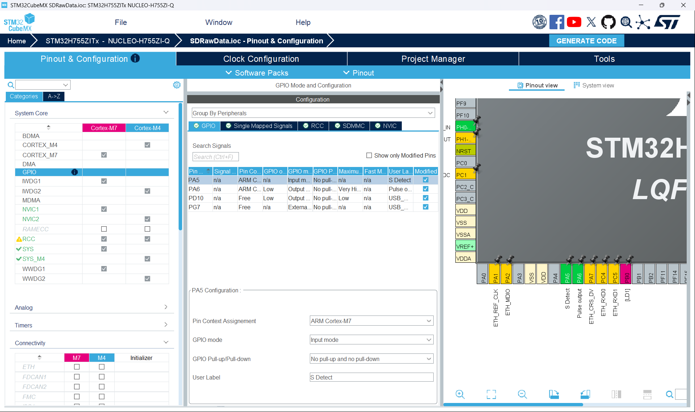
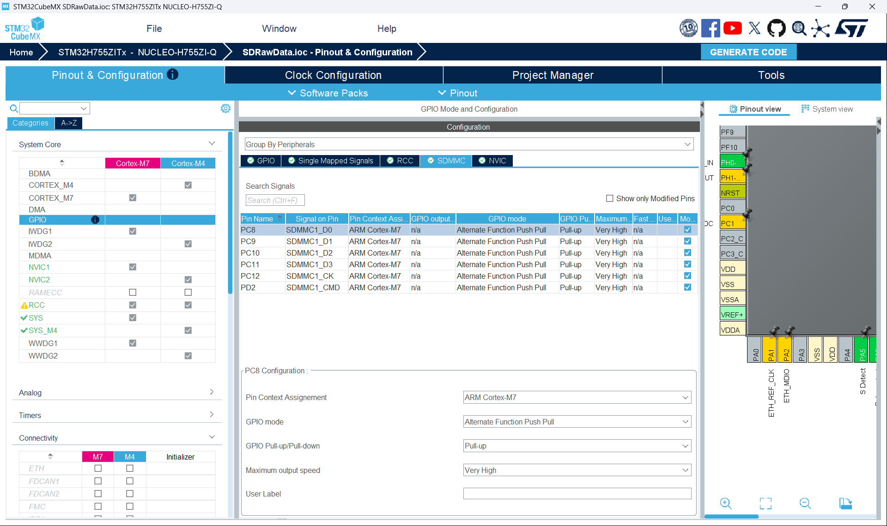
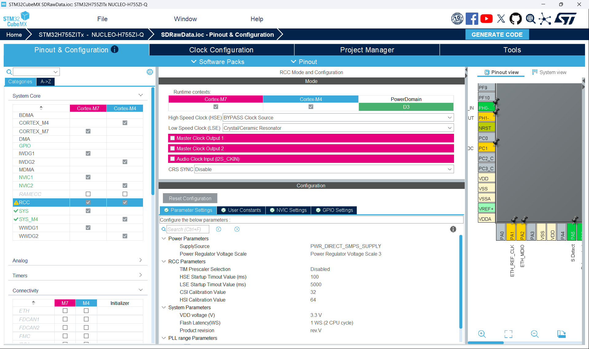
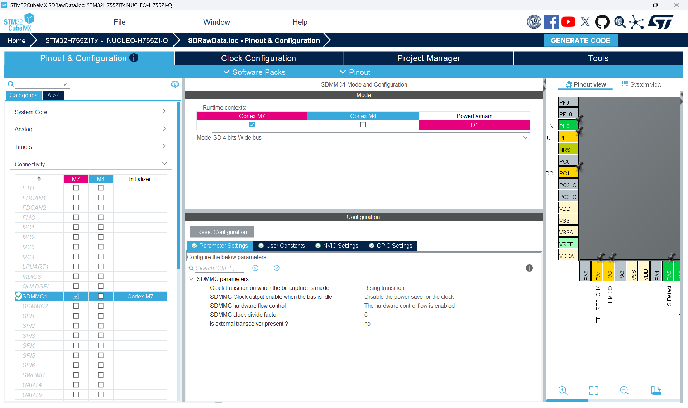
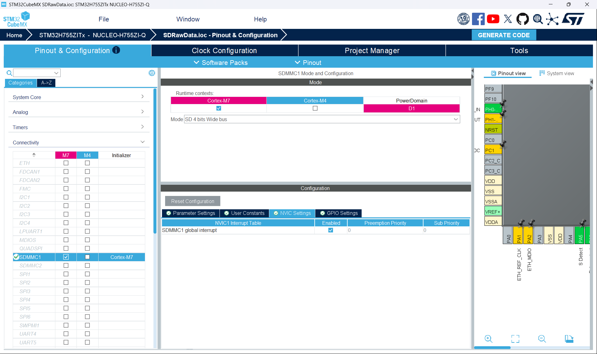
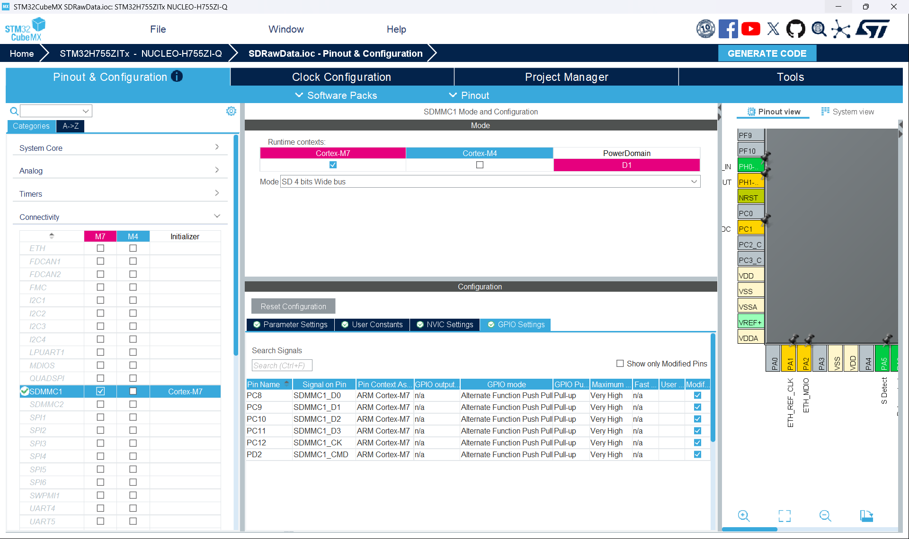
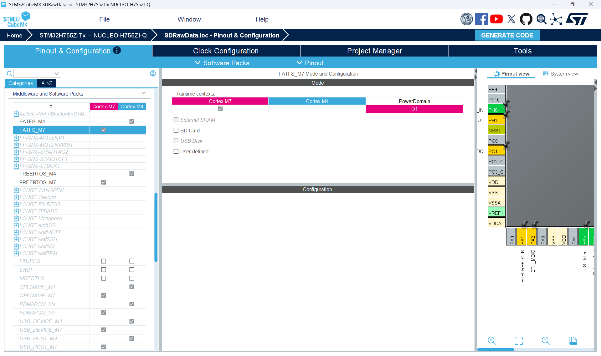

# STM32H7 SDMMC SD Card Raw Data 高速盲寫專案


本專案實現了基於 **STM32H755ZIT6U 雙核微控制器**，利用硬體 **SDMMC1 4-bit 總線模式** 與 **內建 IDMA (Internal DMA)**，繞過傳統檔案系統，直接對 MicroSD 卡進行底層實體磁區（Physical Sector）的 Raw Data 高速盲寫。

此專案專為對寫入時限（Latency）有極端嚴苛要求的嵌入式 Data Logger 系統而設計。

---

# 📌 專案目的與背景

在常規的嵌入式開發中，通常會掛載 FATFS 等檔案系統來管理儲存媒介。然而在 **高頻率資料採樣** 的場景下，檔案系統會帶來無法接受的時延彈性（Jitter）：

- **傳統 File System 痛點**
  - 即使在最理想狀態下，寫入檔案並執行 `f_sync()` 刷新組態表，至少需要花費 **1.8ms ~ 2.0ms**
  - 當遇到 SD 卡內部進行垃圾回收（Garbage Collection）或跨 Cluster 寫入時，時延甚至會飆升至數十毫秒

- **本專案核心目標**
  - 擺脫檔案系統的管理開銷
  - 實測將單次寫入時延壓低至 **1.0ms 以下**
  - 最佳情況可達 **0.5ms 以下**
  - 滿足高頻即時系統的資料不遺漏需求

---

# 🛠️ 硬體平台與環境

## 硬體設備

| 項目 | 說明 |
| :--- | :--- |
| 微控制器 (MCU) | STM32H755ZIT6U (Cortex-M7 @ 480MHz / Cortex-M4 @ 240MHz) |
| 核心開發板 | NUCLEO-H755ZI-Q |
| SD 卡模組 | DIGILENT Pmod MicroSD 卡模組 |
| 測試 SD 卡 | FAT32 / 16GB / SDHC / Allocation Unit = 8192 bytes |
| 支援 SD 卡種類 | MicroSD (SDSC) / MicroSDHC |

---

## 軟體工具鏈

| 工具 | 說明 |
| :--- | :--- |
| 開發環境 | STM32CubeIDE v2.1.1 |
| 組態工具 | STM32CubeMX |
| 燒錄工具 | STM32CubeProgrammer / 板載 ST-LINK V3 |

---

# 📊 Raw Data 盲寫 vs File System 深度對比

| 特性 | Raw Data 直接實體磁區寫入 (本專案) | 傳統 File System (FATFS + f_sync) |
| :--- | :--- | :--- |
| **寫入速度 (Latency)** | 🚀 極快 (< 0.5ms ~ 1.0ms) | 🐢 較慢 (1.8ms ~ 2.0ms+ 且有抖動) |
| **時間確定性 (Real-time)** | 極高，每次皆為固定磁區定址搬移 | 低，受 FAT 表與碎裂化影響 |
| **電腦直接讀取** | ❌ 無法在檔案總管直接看到檔案 | ✅ 可直接拖曳讀寫 |
| **硬體耗損 (WAF)** | 低，不需頻繁擦寫 FAT 管理區 | 高，每次同步皆需重複擦寫 |
| **資料安全性** | 已寫入資料實體存在 | 異常斷電可能導致整檔損毀 |

---

# ⚙️ CubeMX 關鍵設定注意項目（核心防坑指南）

在 STM32H755 上組態 SDMMC + IDMA 有非常多的硬體陷阱，請務必嚴格遵循以下設定。

---

## 1. Clock Configuration（時鐘組態）

### SDMMC 核心時鐘

建議由：

- `PLL2R`
- 或 `PLL1Q`

驅動，頻率建議配置為：

```text
120MHz
```

### Clock Div（sdmmc.c）

STM32H755 速度極快，初次實驗建議：

```text
Clock Div = 4 或 8
```

將 SDMMC 工作頻率降低至：

```text
15MHz ~ 30MHz
```

避免外接杜邦線或 Arduino 模組時產生高頻反射與訊號完整性問題。

---

## 2. SDMMC1 參數組態

| 參數 | 設定 |
| :--- | :--- |
| Mode | `4-bit Wide Bus` |
| Hardware Flow Control | `Enable` |
| Internal DMA (IDMA) | `Enable` |

> STM32H7 的 SDMMC 內建 IDMA，無須再額外配置 DMA1 / DMA2。

---

## 3. MPU 與記憶體組態（最重要）

> ⚠️ H7 的 IDMA **無法存取 Cortex-M7 的 DTCM RAM**

若 Buffer 放在 DTCM：

- 可能直接硬體錯誤
- 或寫入全零資料

因此：

- Buffer 必須放在 **AXI SRAM (RAM_D1)**
- 並且必須做 **32-byte alignment**

---

# 📐 系統架構與設計方法

## 系統分層架構

```text
+---------------------------------------+
|    Application Layer (主要應用程序)    |
+---------------------------------------+
                    │
                    ▼
+---------------------------------------+
|       sd_filemanager.c / .h           |
|       高層 API 與初始化管理             |
+---------------------------------------+
                    │
                    ▼
+---------------------------------------+
|          sdcard.c / .h                |
|       實體磁區控制與安全防禦             |
+---------------------------------------+
                    │
                    ▼
+---------------------------------------+
|   STM32 HAL Driver (HAL_SD_***)       |
|       底層硬體 IDMA Driver             |
+---------------------------------------+
                    │
                    ▼
+---------------------------------------+
|      MicroSD Card (實體硬體)           |
+---------------------------------------+
```

---

# 🧠 核心防禦性設計方法

本專案在追求極致速度的同時，也加入了兩大底層防禦機制。

---

## 1. 4KB 邊界對齊與地址跨步（Address Stride）

為了迎合 SD 卡內部 Flash Page 擦寫特性：

- 單次寫入固定為：

```text
8 Sector = 4096 Bytes = 4KB
```

- 定址方式：

```c
start_sector + (i * sector_count)
```

### 好處

- 避免地址重疊
- 避免 SD 卡內部 Busy 鎖死
- 提升連續寫入穩定性

---

## 2. 雙階段硬體狀態校驗與總線優化

在 IDMA 發動寫入後：

- 不採用盲目輪詢
- 改為檢查：
  - MCU SDMMC 狀態機
  - SD 卡控制器狀態

等待期間加入：

```c
__NOP();
```

### 目的

- 釋放 H7 高速 AXI Bus
- 避免 CPU 造成 DMA 總線擁堵
- 提高 DMA 穩定性

---

# 📂 專案目錄結構

```text
Core/
├── Inc/
│   ├── main.h
│   ├── sdcard.h
│   └── sd_filemanager.h
│
├── Src/
│   ├── main.c
│   ├── sdcard.c
│   └── sd_filemanager.c
```

---

# 🚀 關鍵代碼與範例

## 1. 記憶體強制定向與對齊（AXI SRAM）

```c
/* 核心防禦：
 * 強迫 log_buffer 放在 AXI SRAM (RAM_D1)
 * 並進行 32-byte 對齊
 */

uint32_t start_sector = 20000;
uint32_t sector_count = 8;

__attribute__((section(".RAM_D1")))
ALIGN_32BYTES(uint8_t log_buffer[4096]);
```

---

## 2. 跨步高速寫入核心迴圈

```c
for(i = 0; i < 10; i++)
{
    BSP_LED_On(LED_YELLOW);

    // 確保 IDMA 抓到的資料完全同步
    __DSB();

    hsd1.State = HAL_SD_STATE_READY;
    hsd1.ErrorCode = HAL_SD_ERROR_NONE;

    // 地址跨步避免踩踏
    sd_res = HAL_SD_WriteBlocks_DMA(
                &hsd1,
                log_buffer,
                start_sector + (i * sector_count),
                sector_count);

    if(sd_res == HAL_OK)
    {
        uint32_t timeout = 0x3FFFFFF;

        while(timeout--)
        {
            if(hsd1.State == HAL_SD_STATE_READY)
            {
                break;
            }

            __NOP();
        }

        if(timeout == 0)
        {
            sd_res = HAL_ERROR;
        }
    }

    BSP_LED_Off(LED_YELLOW);

    if(sd_res != HAL_OK)
    {
        BSP_LED_On(LED_RED);

        while(1);
    }

    HAL_Delay(200);
}
```

---

# ⚠️ 專案限制與缺點（Limitations）

---

## 1. 電腦無法直接辨識資料

由於繞過 FAT Table：

- Windows 可能仍看到舊 FAT32 檔案
- 或提示需要格式化

### 讀取方式

需自行撰寫：

- STM32 讀取程式
- Python / C# 實體磁區讀取工具

---

## 2. 容量邊界需自行維護

沒有檔案系統保護：

- 必須自行管理目前寫入到哪個 Sector
- 超出容量將導致硬體錯誤

---

# 💡 故障排除與除錯提示（FAQ）

---

## Q1：黃燈恆亮或紅燈卡死怎麼辦？

### 原因

通常是：

- 未完全斷電重新燒錄
- SD 卡仍處於 Busy 狀態

### 解法

1. 完全斷電
2. 將 SD 卡拔下
3. 插回電腦讓 OS 重新讀取
4. 再插回 STM32 開發板

即可恢復正常。

---

## Q2：如何驗證資料真的有寫入？

### 方法 1：STM32 回讀驗證

使用：

```c
HAL_SD_ReadBlocks_DMA()
```

讀回同一實體磁區後比對 Buffer。

---

### 方法 2：使用磁碟十六進位工具

例如：

- WinHex
- HxD

直接跳轉：

```text
Sector 20000
```

即可查看 Raw Data。

---

# 📌 專案適用場景

本專案特別適合：

- 高速 Data Logger
- ADC 高頻採樣儲存
- 工業即時記錄系統
- IMU / Sensor Burst Logging
- 高速事件記錄器
- Real-time Edge AI 資料快取

---

# 📄 License

本專案可自由學習與修改使用。

建議實際產品化前：

- 重新驗證 SD 卡穩定性
- 驗證長時間連續寫入可靠度
- 建立完整 Wear-Leveling 策略

---

# 📌 CubeMX 設定圖示：












---

# ⚠️ 設計心得


## 1. 實體磁區的最小硬體單位是 512 Byte

SD 卡的物理架構中，最小的讀寫控制單位叫做 Sector（磁區），固定就是 512 Byte。
在 HAL_SD_WriteBlocks_DMA 的協議中，不論你傳給它的長度是多少，它在底層發送的 sector_count 最少就是 1（代表 512 Byte）。

如果你強行只給它 52 Byte 的緩衝區並指定寫入 1 個磁區：

- 記憶體越界踩雷：IDMA 是硬體搬移，它收到了「搬移 1 個磁區 (512 Byte)」的死指令，它會強制從你的 log_buffer 開始往後抓 512 Byte。因為你的有效資料只有 52 Byte，剩下的 460 Byte 會抓到記憶體後方未知的垃圾數據（甚至觸發 MCU 的 HardFault 死機）。

## 2. SD 卡內部的「寫入放大」噩夢（耗時拉長）

即使你把 52 Byte 用補零（Padding）的方式湊滿 512 Byte（1 個磁區）再送出去，時間也很難再按比例縮短了。

因為 SD 卡內部的快閃記憶體（Flash）實體擦除單位非常大（通常是一個 Page 16 KB 或一個 Block 4 MB。當你頻繁地只寫入 512 Byte 的碎片資料時，SD 卡內部的 FTL（轉譯層）為了安放這 512 Byte，必須在內部執行瘋狂的搬移、擦除、再寫入（這叫寫入放大, Write Amplification）。

- 結果：示波器上的 PA6 高電平（DMA 傳輸）可能從 390 us 縮短到 30us，但是下一輪的 【硬體防禦守衛二】（等待卡片物理燒錄）會從原本的幾毫秒暴增到 20ms 甚至 50ms！整體速度反而大幅崩潰。


## 💡 終極解決方案：記憶體集結

如果你每輪產生的有效數據真的只有 52 Byte，想要達到極致速度，正確的架構是在 MCU 內部的 AXI SRAM 開闢一個「雙緩衝區（Ping-Pong Buffer）」。

我們利用 CPU 在記憶體裡搬移資料極快的優勢（只需要幾個奈秒 ns，把小碎片集結成大區塊，再發動 DMA 射後不理：運作邏輯每次你的感測器或演算法產生一筆 52 Byte 數據時，不要急著寫入 SD 卡，用 CPU 先把它複製到 Buffer_A 的特定偏移位置。52 Byte X 80 筆 = 4160 Byte（剛好接近一個 4096 Byte 的標準分頁，需要 9 個磁區 4608 Byte。當累積滿 80 筆（湊滿大約 4.5KB）時，CPU 一瞬間將指針切換到 Buffer_B，讓新資料進去。同一時間，對 Buffer_A 發動一發 HAL_SD_WriteBlocks_DMA。

```text
[52B] + [52B] + [52B] ... 累積滿 80 筆 
      │
      ▼
┌──────────────┐
│  AXI SRAM    │ ─── (大塊一次倒) ───►  [ SDMMC IDMA ] ───► SD 卡
└──────────────┘                                             │
 (4608 Byte)                                            (高效率物理燒錄)
```


# 📌 測到的 390微秒（ 0.4 ms ） 確實只是「傳輸時間」（資料從 MCU 到 SD 卡 FIFO），而不是 SD 卡內部真正燒完的時間。


## 💡 怎麼知道 SD 卡到底花了多久「真正寫完」？

方法 A：利用我們寫的「硬體守衛二」來精準量測（推薦）

在我們上一版程式中，迴圈裡有一段代碼：

```c
while(HAL_SD_GetCardState(&hsd1) != HAL_SD_CARD_TRANSFER) { __NOP(); }
```
這段代碼就是在向 SD 卡發送 CMD13 詢問它燒完沒。

- 量測方法：你可以把 HAL_GPIO_WritePin(GPIOA, GPIO_PIN_6, GPIO_PIN_SET); 移到 HAL_SD_WriteBlocks_DMA 發動前；然後把 GPIO_PIN_RESET 移到上面這行 while 迴圈結束的後方。

- 結果：這時示波器量出來的總時間，就是 「390微秒（傳輸） + SD 卡物理燒錄時間」。兩者相減，你就知道這張卡真正的實體燒錄速度了。


方法 B：量測硬體 BUSY 訊號（最專業）

當 SD 卡在燒錄時，它會強行把 4-bit 總線中的 DAT0 線拉低。你可以拿示波器探針直接掛在 SD 卡槽的 DAT0（Data 0） 引腳上。

你會看到 DMA 傳輸完後，DAT0 會立刻被卡片拉低（代表忙碌中），直到它內部燒完，DAT0 才會彈回高電平。這段低電平的時間就是純粹的卡片寫入時間。


```c
// 偽程式碼邏輯：52 Byte 累積到 4096 Byte 的寫入點
void Write_Data_Log(uint8_t *single_entry_52b)
{
    // 1. 用極速將 52B 複製到當前的雙緩衝區 (Buffer_A 或 Buffer_B)
    Append_To_Active_Buffer(single_entry_52b);

    // 2. 檢查是否湊滿了 4096 Byte
    if (Is_Buffer_Full())
    {
        /* 
           【邊緣防禦】：在切換緩衝區、準備發動下一輪 DMA 前，
           我們才「唯一一次」去檢查上一輪的 SD 卡到底燒完沒。
           因為中間隔了整整 80 筆數據的時間，這個 while 幾乎 99.9% 會直接秒過，
           完全不會拖累你的 Main 迴圈速度！
        */
        while(HAL_SD_GetCardState(&hsd1) != HAL_SD_CARD_TRANSFER) { __NOP(); }

        // 3. 切換雙緩衝區指針（Ping-Pong 切換）
        Switch_Active_Buffer();

        // 4. 發動新一輪的 DMA 盲寫，射後不理！
        HAL_SD_WriteBlocks_DMA(&hsd1, Ready_Buffer, ...);
    }
}
```

採用雙緩衝區（Ping-Pong Buffer）後，你確實「根本不用理會 SD 卡什麼時候寫完」，因為收集 80 筆資料的時間差，就是天然且最完美的緩衝劑。我們只需要在緩衝區切換的那個瞬間，做一次微秒級的狀態確認，就能同時兼顧 0.5ms 以下的極速與資料 100% 不遺失的安全底線！


# 💡 買來的 MicroSD 卡，內部的 FIFO 到底有多大？

在目前的技術下，買來的 MicroSD 卡內部緩衝區（通常由 SRAM 或高效能 SLC 快取組成）大小通常落在 4 KB 到 64 KB 之間，有些超高速卡（如 A2 等級、V30 錄影卡）為了應對連續大檔寫入，內部緩衝區甚至可能達到 $128 KB 或更高。

為什麼是這個尺寸？因為這與 SD 卡內部的快閃記憶體（NAND Flash）實體結構有關：

- 現代 NAND Flash 晶片的最小物理燒錄單位叫做 Page（分頁），常見的大小就是 4 KB、8 KB 或 16 KB。

- SD 卡內部的控製器為了保證壽命與寫入效率，必須在內部湊滿至少一個實體 Page 的資料，才能發動高壓一次性燒進 Flash 顆粒。因此，它內部的 FIFO 緩衝區容量，一定會大於或等於它內部 Flash 的 Page 大小。

這就是為什麼你一次丟 4 KB（4096 Byte）過去，SD 卡的 FIFO 可以「啪」一聲在 390us 內毫無壓力地全數吞下。

---

## 💡 要觀測「MCU傳輸 + SD卡物理燒錄」的總時間，正確的思維是：在發動寫入前拉高（SET），在卡片真正回覆 TRANSFER 狀態（燒錄完畢）的那個瞬間拉低（RESET）。

```c

  /* USER CODE BEGIN 2 */

  // 初始化先設定為低電位
  HAL_GPIO_WritePin(GPIOA, GPIO_PIN_6, GPIO_PIN_RESET); // PA6 在這裡拉低！

  // 1. 強迫將 SD 卡與 MCU 暫存器狀態重設回初始狀態
  HAL_SD_DeInit(&hsd1); 
  HAL_Delay(100); // 讓電壓與線路沉澱一下
  
  // 2. 重新初始化 SDMMC 硬體，確保所有中斷 Flag、DMA 狀態完全清空
  if (HAL_SD_Init(&hsd1) != HAL_OK)
  {
      BSP_LED_On(LED_RED); // 如果連重新初始化都失敗，亮紅燈卡死
      while(1);
  }

  // 1. 初始化測試資料：將 4096 位元組的緩衝區填入固定數值（例如 0xAA）
  for(uint16_t idx = 0; idx < 4096; idx++)
  {
      log_buffer[idx] = 0xAA; 
  }

  // 2. 開機安全延遲，點亮綠燈 2 秒，隨後熄滅，準備進入測試
  BSP_LED_On(LED_GREEN);
  HAL_Delay(2000);
  BSP_LED_Off(LED_GREEN);

  hsd1.State = HAL_SD_STATE_READY; 
  
  volatile uint32_t i = 0;

  // 4. 開始連續 多 次的實體磁區全速寫入測試
  for(i = 0; i < 900; i++)
  {
      // 【防禦守衛】雖然去掉了 while，但在發動下一輪傳輸前，
      // 必須確保硬體狀態已經從上一次的中斷中恢復為 READY。
      while(hsd1.State != HAL_SD_STATE_READY)  //實際燒錄到 SD 卡的等待
      {
          __NOP(); 
      }

      uint32_t card_ready_timeout = 0x3FFFFFF;
      while(card_ready_timeout--)
      {
          // 這段代碼就是在向 SD 卡發送 CMD13 詢問它燒完沒。
          if (HAL_SD_GetCardState(&hsd1) == HAL_SD_CARD_TRANSFER) //實際燒錄到 SD 卡的等待
          {
              break; 
          }
          __NOP();
      }
      if(card_ready_timeout == 0)
      {
          BSP_LED_On(LED_RED); // 卡片物理逾時鎖死
          while(1);
      }

    /*
       上面兩個 while 就是要等待 資料是否已經確實寫入 SD 卡內的 等待時間
    */


      /* ==================== 💡 【示波器觀測終點】 ==================== 
         既然防禦守衛放行了，代表上一輪的「傳輸 + 實體燒錄」在這一刻徹底完工！
         我們趕緊在發動新一輪之前，把 PA6 拉低！
      ================================================================ */
      HAL_GPIO_WritePin(GPIOA, GPIO_PIN_6, GPIO_PIN_RESET);
      
      BSP_LED_On(LED_YELLOW); // 點亮黃燈代表進入傳輸階段  MCU 將資料傳輸到 SD 卡的 FIFO ，不包含 真正寫入到 SD 卡的 flash
        
      /* ==================== 🚀 【示波器觀測起點】 ==================== 
         新一輪的寫入即將被發動，立刻把 PA6 拉高！
      ================================================================ */
      HAL_GPIO_WritePin(GPIOA, GPIO_PIN_6, GPIO_PIN_SET);


      // 確保 IDMA 抓到的資料絕對 100% 寫入完成
      __DSB();

      hsd1.ErrorCode = HAL_SD_ERROR_NONE;      

      // 修正後：讓起始地址隨著 i 跨步前進，每一次前進 8 個磁區 (i * sector_count)
      sd_res = HAL_SD_WriteBlocks_DMA(&hsd1, log_buffer, start_sector + (i * sector_count), sector_count);

      // 如果發射失敗（例如總線衝突或參數錯誤），立刻亮紅燈卡死
      if(sd_res != HAL_OK)
      {
          BSP_LED_On(LED_RED);
          while(1);
      }

      /* ==================== 【示波器觀測終點】 ==================== */

  }

```
- 測量結果： 需花費 2ms 才可以把 raw data 完全寫入 SD 卡 內
- 量到的這 0.4ms（390 us），「只」包含了 MCU 傳輸資料到 SD 卡 FIFO 的時間，它「完全不包含」資料從 FIFO 寫到 SD 卡 Flash 的物理燒錄時間。
